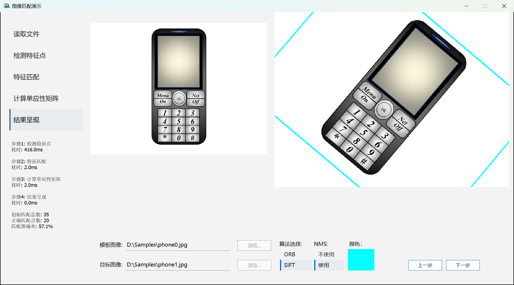

# ImageMatching

## 一个免费，开源的图像匹配算法逐步演示软件

## 特点

1. 简洁而现代化的UI
2. 步骤回看功能
3. 免安装、轻量化的设计

## 快速上手

1. 启动软件，选择合适的模板和目标图像；
2. 选择算法（SIFT或ORB）、是否使用NMS（非极大值抑制）；
3. 点击“颜色：”下方的色块选择特征点连线等的颜色；
4. 可以点击“下一步”“上一步”或左侧的列表框来切换步骤；
5. 算法的部分数据显示在窗口左下角。

## 编译源码

需要安装以下外部库或组件：

OpenCV 4.4+

MSVC v145

C++ MFC (MSVC v145)

## 发现一个问题？

提交一个issue https://github.com/SWD-Studio/ImageMatching/issues

## 系统要求：
操作系统：Windows 11 x64 或更高

硬盘：10MB及以上空闲空间

## 开发环境：

操作系统：Windows 11 25H2

IDE：Visual Studio 2026

C++编译器：MSVC v145

OpenCV版本：4.12.0

## License

ImageMatching is under the [MIT License](https://github.com/SWD-Studio/ImageMatching/blob/main/LICENSE). External libraries used by ImageMatching are distributed under their own licenses.

In short, ImageMatching is free for any use (commercial or personal, proprietary or open-source). You can use ImageMatching in your project without any restriction.

## ImageMatching 使用的外部库

-   [OpenCV](https://github.com/opencv/opencv) is under the [Apache 2.0 License](https://github.com/opencv/opencv/blob/4.x/LICENSE)
